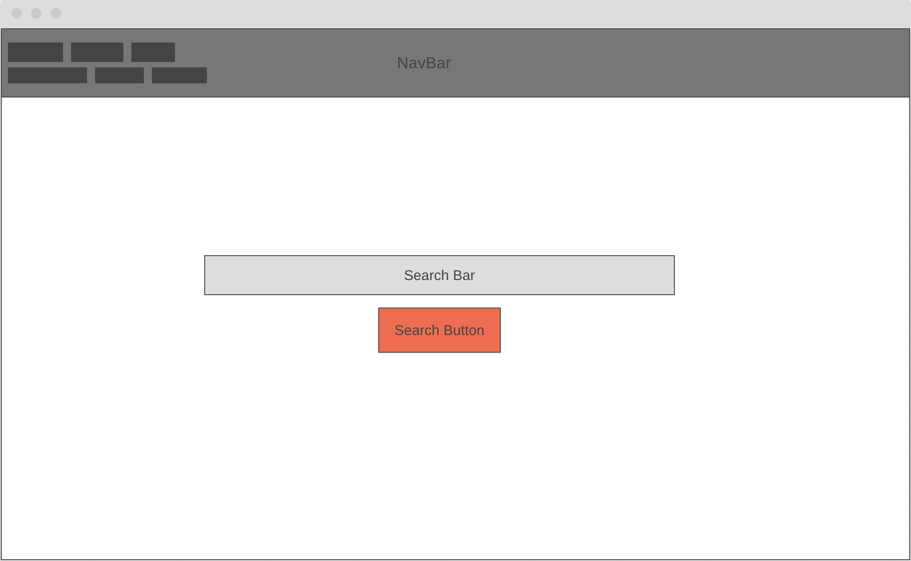
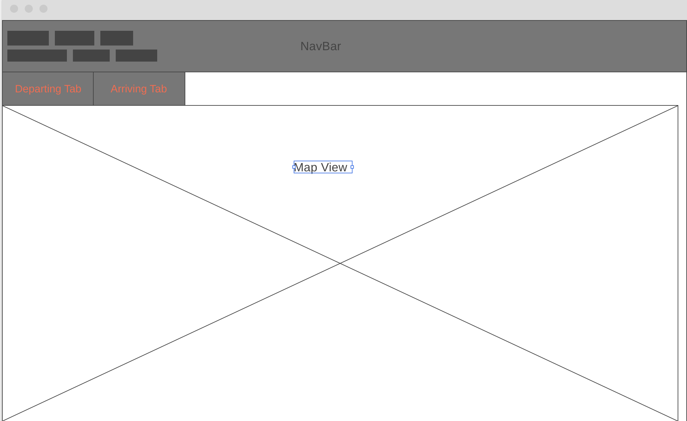

# AviDar

This is a very basic react application that shows all departing and arriving flights for a specific city of the user chosing.

## Description

Lets the user see flights for single day plotted on a map , if the user hover over the arcs , the user can see
some information about those flights.

### Technical Used

```

- React
- Bootstrap with react
- Ajax (axios) for API
- React Router
- React Map gl , deck.gl
```

### Wireframes

Home Page


Map Page


### User Stories

- The user can search for the wanted city in the home page.
- The user can't leave the search box empty.
- The user should input the right spelling for the wanted city.
- The user can see on the map the actual flights trajectory.
- The user can interact with the trajectory lines by hovering over them to see the flights info.

---

## Planning and Development Process

I started by making the necessary component hierarchy and implementing the router and the navbar. Then started adding features one by one , and kept the styling for the end.

### Problem-Solving Strategy

lots and lots of googling and reading official documentation.

### Unsolved problems

searchbar autosuggest and autocomplete.

## APIs Used

```
https://aviation-edge.com/developers/

MapBox by Uber
```

---

## Acknowledgments

- SEI Great Instructors Team.
- Creators of All libraries I have used , such as deck.gl and react-map gl

---

## References

```
https://docs.mapbox.com/help/tutorials/use-mapbox-gl-js-with-react/

https://gist.github.com/ryanbaumann/143396c1cbc33efe40a39e137aec6c45

https://react-bootstrap.github.io/

https://reacttraining.com/react-router/web/guides/quick-start

https://alligator.io/react/axios-react/


```
